# Design

`fqxv` treats a FASTQ record as three streams and compresses each with a
purpose-built codec, then composes them into a parallel, block-based container.

## The three streams

| Stream | Share of a lossless archive | What moves it |
| --- | --- | --- |
| Quality scores | ~50% | a context-model entropy coder |
| Sequence | most of the rest | an order-k adaptive base model |
| Read names | small | a positional tokenizer |

## The crates

Each algorithm is a standalone crate, so the codecs can be used and published
independently:

```mermaid
graph TD
    CLI[fqxv-cli] --> C[fqxv &#40;container&#41;]
    C --> TOK[fqxv-tokenizer]
    C --> SEQ[fqxv-seq]
    C --> FQZ[fqxv-fqzcomp]
    TOK --> RANS[fqxv-rans]
    SEQ --> RANGE[fqxv-range]
    FQZ --> RANGE
```

- **`fqxv-rans`** — rANS Nx16 entropy coder (32 interleaved states, 16-bit
  renormalization), with scalar and AVX2 decode backends selected at runtime.
- **`fqxv-range`** — a Subbotin carryless range coder plus an adaptive
  frequency model; the backend for the quality and sequence context models.
- **`fqxv-fqzcomp`** — a fqzcomp-style quality model: each symbol is coded under
  a context of the two previous qualities and position, one adaptive model per
  context, reset at read boundaries. Opt-in Illumina 2/4/8-level binning.
- **`fqxv-seq`** — an order-k adaptive base model over a 2-bit A/C/G/T alphabet;
  non-ACGT bytes go to a delta-coded exception list.
- **`fqxv-tokenizer`** — splits names into digit/non-digit runs and models each
  token against the previous record's token at the same position (match / delta
  / literal), rANS-coding the op and payload streams.
- **`fqxv-reorder`** — canonical-minimizer read clustering (see
  [Read Reordering](reordering.md)).

## Clean-room provenance

The CRAM-family codecs (rANS Nx16, the fqzcomp quality model, the name
tokenizer) are implemented from the published CRAM 3.1 codecs specification and
source papers — not translated from C. See `THIRD-PARTY-NOTICES.md` in the
repository. Everything is dual-licensed MIT OR Apache-2.0.

## Design principles

- **Measure, don't assume.** Backends and parameters are chosen on measured
  numbers. The AVX2 rANS path, for instance, is *not* the default on AMD Zen 3,
  where its gather instructions measured slower than the autovectorized scalar
  path.
- **Parallelism is a first-class concern.** Everything blocks and fans out with
  `rayon`; output is deterministic across thread counts.
