# Design

`fqxv` treats a FASTQ record as three streams and compresses each with a
purpose-built codec, then composes them into a parallel, block-based container.

## The three streams

| Stream | Share of a lossless archive | What moves it |
| --- | --- | --- |
| Quality scores | ~50% | a context-model entropy coder |
| Sequence | most of the rest | an order-k adaptive base model |
| Read names | small | a positional tokenizer |

## The crates

Each algorithm is a standalone crate, so the codecs can be used and published
independently:

```mermaid
graph TD
    CLI[fqxv-cli] --> C[fqxv &#40;container&#41;]
    C --> TOK[fqxv-tokenizer]
    C --> SEQ[fqxv-seq]
    C --> FQZ[fqxv-fqzcomp]
    C --> REO[fqxv-reorder]
    C --> LRO[fqxv-lroverlap]
    TOK --> RANS[fqxv-rans]
    SEQ --> RANGE[fqxv-range]
    SEQ --> DNA[fqxv-dna]
    FQZ --> RANGE
    REO --> RANS
    REO --> SEQ
    REO --> DNA
    LRO --> SEQ
    LRO --> RANS
    LRO --> DNA
```

Two leaf crates sit below the codecs and are shared by several of them:
`fqxv-dna` (nucleotide primitives — the 2-bit ACGT lookup and reverse
complement) and `fqxv-bytes` (on-disk byte primitives — LEB128 varints, zig-zag,
the bounds-checked reader). They are omitted from some edges above to keep the
graph legible.

- **`fqxv-rans`** — rANS Nx16 entropy coder (32 interleaved states, 16-bit
  renormalization), with scalar, AVX2, and AVX-512 backends selected at runtime
  (the widest detected path wins). The AVX2 and AVX-512 paths cover order-0
  encode and decode; order-1 and everything below AVX2 run the scalar reference.
- **`fqxv-range`** — a Subbotin carryless range coder plus an adaptive
  frequency model; the backend for the quality and sequence context models.
- **`fqxv-fqzcomp`** — a fqzcomp-style quality model: each symbol is coded under
  a context of the two previous qualities and position, one adaptive model per
  context, reset at read boundaries. Opt-in lossy binning: Illumina 2/4/8-level,
  plus ONT and PacBio HiFi tables (see [Long-read support](longread.md)).
- **`fqxv-seq`** — an order-k adaptive base model over a 2-bit A/C/G/T alphabet;
  non-ACGT bytes go to a delta-coded exception list.
- **`fqxv-tokenizer`** — splits names into digit/non-digit runs and models each
  token against the previous record's token at the same position (match / delta
  / literal), rANS-coding the op and payload streams.
- **`fqxv-reorder`** — canonical-minimizer read clustering (see
  [Read Reordering](reordering.md)).
- **`fqxv-lroverlap`** — cross-read overlap coding for long reads
  (minimizers → overlaps → layout → consensus → per-read banded edit script →
  rANS). **Wired into the container**: it is the sequence path for long-read
  blocks, auto-selected per block via the sequence stream's method byte and kept
  only when it beats the order-k model — see [Long-read support](longread.md).
- **`fqxv-dna`** — a leaf crate of shared nucleotide primitives (the 2-bit ACGT
  lookup and reverse complement) that `fqxv-seq`, `fqxv-reorder`, and
  `fqxv-lroverlap` build on; the single source of truth so those variants can't
  drift.
- **`fqxv-bytes`** — a leaf crate of shared byte-serialization primitives
  (LEB128 varints, zig-zag, the bounds-checked reader) that `fqxv-seq`,
  `fqxv-reorder`, `fqxv-fqzcomp`, and `fqxv-tokenizer` all read/write on disk; the
  single source of truth for those encodings.

## Clean-room provenance

The CRAM-family codecs (rANS Nx16, the fqzcomp quality model, the name
tokenizer) are implemented from the published CRAM 3.1 codecs specification and
source papers — not translated from C. See `THIRD-PARTY-NOTICES.md` in the
repository. Everything is dual-licensed MIT OR Apache-2.0.

Every compression path is pure-Rust and self-contained: there is **no external or
C compression library** anywhere in the stack. Even the whole-file reference frame
of the reordering codec (once handed to xz/`liblzma`) is now coded with the
in-tree order-k `fqxv-seq` model.

## Design principles

- **Measure, don't assume.** Codec choices are made on measured bytes, per input.
  The long-read overlap codec, for instance, is adopted for a block only when it
  actually beats the order-k model, and the whole-file global reference frame is
  written only when it nets a size win over the block-local codecs — so a codec
  can never enlarge the archive.
- **Parallelism is a first-class concern.** Everything blocks and fans out with
  `rayon`; output is deterministic across thread counts.

## See also

- [Long-read support](longread.md) — what works on ONT/PacBio today, the
  measured per-stream gap to CoLoRd, and the overlap codec that closes it.
- [Testing & Robustness](testing.md) — coverage map, decoder-robustness
  guarantees, and roadmap drawn from the upstream tools' issue trackers.
